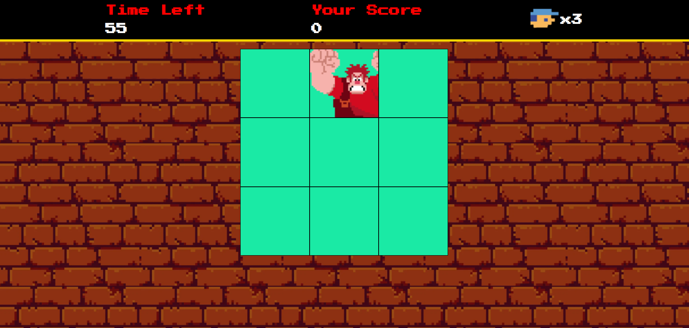

# Detona-Ralph-Dio

Para jogar clique [aqui](https://jclaion.github.io/Detona-Ralph-Dio/)

## Sobre o Jogo

 Juntamente com a [dio.me](https://www.dio.me) foi desenvolvido esse minigame, com intuito de aprender conceitos sobre HTML, CSS e JavaScript.

## Como jogar?
O jogo funciona da seguinte forma, quando o Ralph aparecer em um dos quadrados deve-se clicar no quadrado, assim pontuando de um em um, entretanto caso erre perderá uma vida.  
  
Caso suas vidas ou o tempo acabe o jogo encerra.